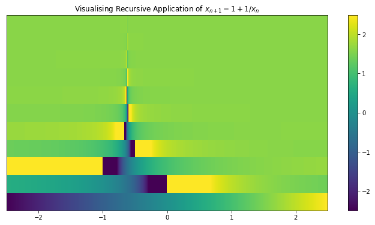

```python
import numpy as np
import matplotlib.pyplot as plt
from IPython.display import YouTubeVideo
```

# Visualising Recursive Function Application

In 3blue1brown's YouTube video (embedded below), Grant uses a way of visualising functions as transformations between number-lines. He uses this technique to show how the limits of the recursive function, 

$$x_{n+1} = 1 + \frac{1}{x_n}$$ 

are the values $\varphi$ and $-\frac{1}{\varphi}$, where $\varphi$ is the golden ratio. However, the power of the visualisation technique was in showing that all starting points $x_0 \neq -\frac{1}{\varphi}$ converge on $\varphi$. In this notebook, we explore visualising this recursive process with stacked number-lines that are coloured to show how different starting points converge in different ways. 


```python
YouTubeVideo('CfW845LNObM')
```


        <iframe
            width="400"
            height="300"
            src="https://www.youtube.com/embed/CfW845LNObM"
            frameborder="0"
            allowfullscreen
        ></iframe>
        


```python
def f(x): return 1 + 1 / x

def generate(x, n=10):
    if n > 0:
        rest = generate(f(x), n-1)
        return np.vstack((x, rest))
    return f(x)
  
x_min, x_max = -2.5, 2.5
nx, ny = 1000, 12
x = np.linspace(x_min, x_max, nx)
y = np.linspace(0, ny, ny)
xx, yy = np.meshgrid(x, y, sparse = False)
zz = generate(x, ny-1)

fig, ax = plt.subplots(figsize = (12, 6))
plt.title('Visualising Recursive Application of $x_{n+1} = 1 + 1 / x_n$')
plt.pcolormesh(xx, yy, zz, cmap='viridis', vmin=x_min, vmax=x_max)
plt.xlim([x_min, x_max])
plt.ylim([0, ny])
ax.get_yaxis().set_ticks([])
plt.colorbar()
plt.show()
```





As we can see, all values seem to converge to the green associated with $\varphi$, and starting values around $-1/\varphi$ move back and forth across each side of it, getting further away with each jump until it crosses into the positive side of the number line and starts to approach $\varphi$.
